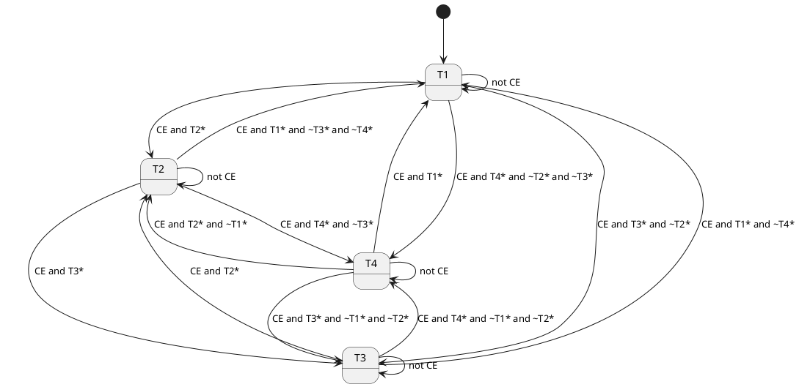
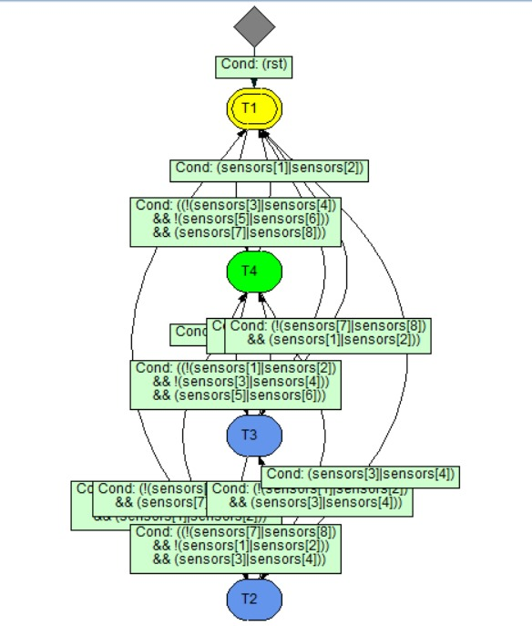
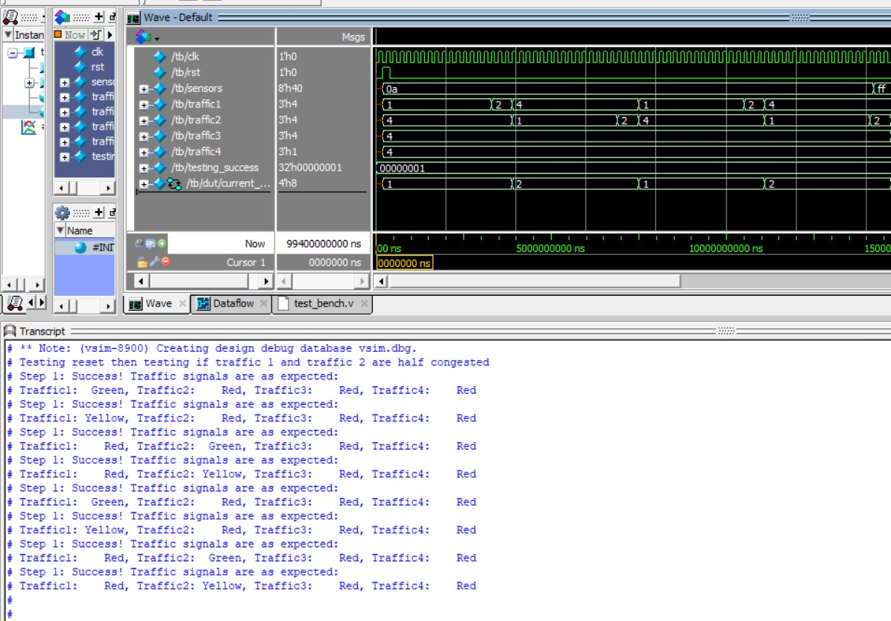
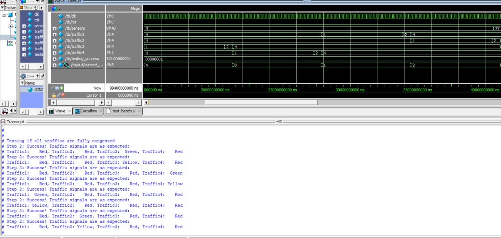
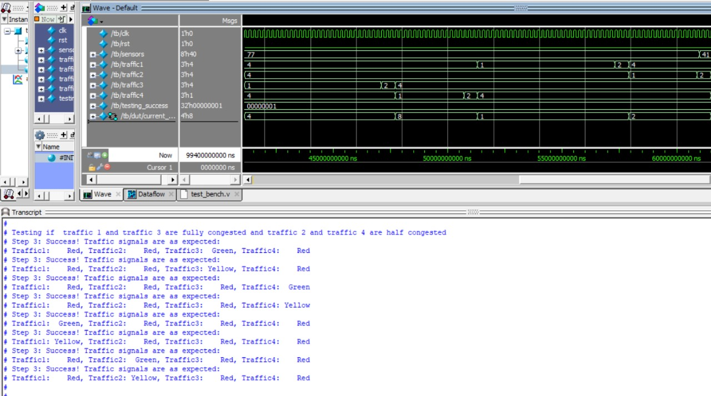
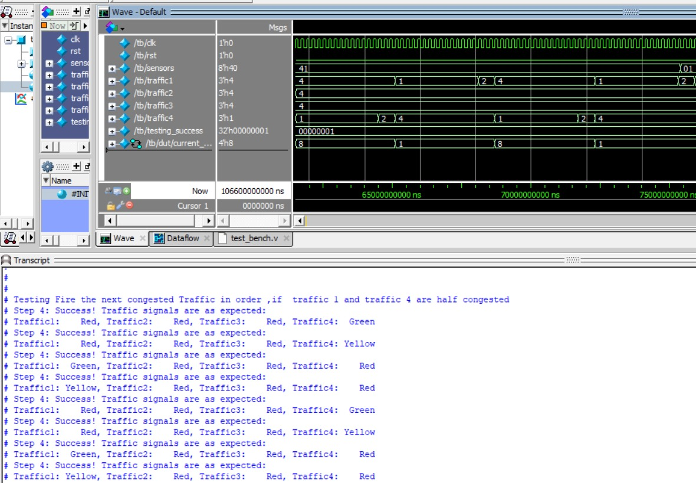
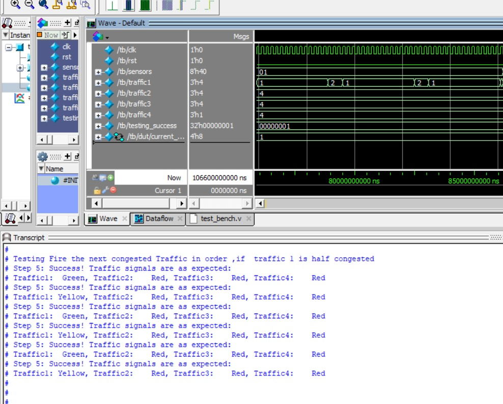
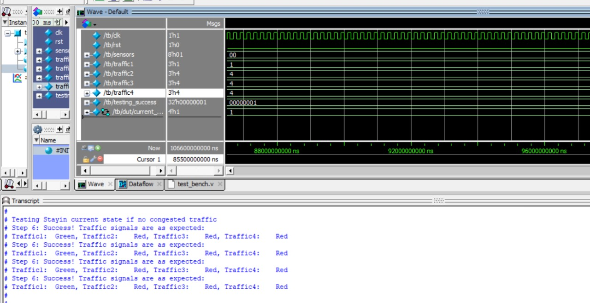
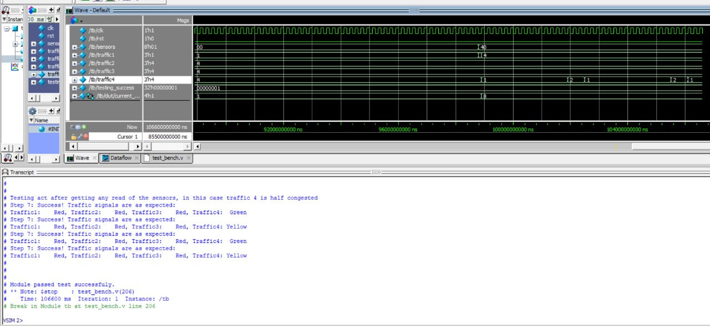

\vspace{24pt}

| **Student**              | **Contribution**                                     |
|--------------------------|------------------------------------------------------|
| **Shams El-Din Mohamed** | Participated in FSM Design, Written Report           |
| **Abdel-Rahman Sherif**  | FSM Design, Module and Test bench                    |
| **Ahmed Saeed**          | System Design, Module and Test bench                 |
| **Mahmoud Essam**        | Participated in System Design, Module and Test bench |


\newpage

\tableofcontents

\newpage

# System Design
## Assumptions
- The two light sensors outputs logical high when a car is present infront of it
- The cars are stacked first at the light sensor, if there is one car, it does not stop behind the traffic line
- Only one traffic light is switched at a time

## Design Overview
- **Sensors:** Eight light sensors (two per intersection) connected to the control panel.
- **Control Panel:** Receives sensor readings and controls the traffic lights.
- **Outputs:**
  - **Green:** Traffic allowed to proceed.
  - **Yellow:** Warning state before switching.
  - **Red:** Traffic must stop.

# Light Algorithm
The algorithm follows these rules:

- **Standard Rotation:** Traffic lights are activated sequentially (1 → 2 → 3 → 4 → 1).
- **Heavy Congestion:** If both sensors for a light are triggered, the green state persists for two cycles (proposed 30 seconds).
- **Empty Light:** If a light's sensors are inactive, it is skipped, and the next light is activated.
- **All Congested:** If all lights are congested, the rotation proceeds with extended green durations.

# Controller Specs
- **Clock Speed:** A modest 100 Hz clock is sufficient for the controller.
- **HDL Design:** Adjust clock ticks in the HDL implementation to align with the clock frequency (for accurate timers).

\newpage

# FSM Design
## Overview

We employ a four-state FSM for traffic light control:
- States represent each light (e.g., T1, T2, T3, T4).
- Transition conditions depend on sensor inputs and counter expiration.

## FSM Design
| **State**                      | **Symbol** |
|--------------------------------|------------|
| Traffic Light 1 (Green/Yellow) | T1         |
| Traffic Light 2 (Green/Yellow) | T2         |
| Traffic Light 3 (Green/Yellow) | T3         |
| Traffic Light 4 (Green/Yellow) | T4         |

| **Input Condition**               | **Abbreviation** |
|-----------------------------------|------------------|
| Sensor 1 or 2 active (Light 1)    | T1*              |
| Sensor 1 and 2 inactive (Light 1) | ~T1*             |
| Sensor 3 or 4 active (Light 2)    | T2*              |
| Sensor 3 and 4 inactive (Light 2) | ~T2*             |
| Sensor 5 or 6 active (Light 3)    | T3*              |
| Sensor 5 and 6 inactive (Light 3) | ~T3*             |
| Sensor 7 or 8 active (Light 4)    | T4*              |
| Sensor 7 and 8 inactive (Light 4) | ~T4*             |
| Counter expired                   | CE               |




## FSM generated from Tool

{#fig:inferred_fsm width=50%}

\newpage

# Code

```verilog
module traffic #(parameter SLOT = 15,Shift=5) (
clk, rst, sensors, traffic1,traffic2,traffic3,traffic4);
input clk, rst;
output reg [2:0] traffic1,traffic2,traffic3,traffic4;
input [8:1] sensors;

parameter T1 = 4'b0001, T2 = 4'b0010, T3 = 4'b0100, T4 = 4'b1000;
parameter Green = 3'b001, Yellow = 3'b010, Red = 3'b100;
parameter Double_slot=SLOT*2+Shift ,Single_Slot=SLOT+Shift;

reg [5:0] counter;
reg [3:0] current_state, next_state;


always @(posedge clk or posedge rst) begin
    if (rst) begin
        current_state = T1;
        counter <= sensors[1] & sensors[2]
         ? Double_slot
         : sensors[1] | sensors[2] ? Single_Slot : 1;
    end else if (counter > 1) begin
        counter <= counter - 1;
    end else begin
        current_state = next_state;
        case (current_state)
            T1: counter <= sensors[1] & sensors[2]
             ? Double_slot : sensors[1] | sensors[2] ? Single_Slot : 1;
            T2: counter <= sensors[3] & sensors[4]
             ? Double_slot : sensors[3] | sensors[4] ? Single_Slot : 1;
            T3: counter <= sensors[5] & sensors[6]
             ? Double_slot : sensors[5] | sensors[6] ? Single_Slot : 1;
            T4: counter <= sensors[7] & sensors[8]
             ? Double_slot : sensors[7] | sensors[8] ? Single_Slot : 1;
        endcase
    end
end

always @(*) begin
    case(current_state)
        T1: begin
            if (sensors[3] | sensors[4]) next_state = T2;
            else if (sensors[5] | sensors[6]) next_state = T3;
            else if (sensors[7] | sensors[8]) next_state = T4;
            else next_state = T1;
        end
        T2: begin
            if (sensors[5] | sensors[6]) next_state = T3;
            else if (sensors[7] | sensors[8]) next_state = T4;
            else if (sensors[1] | sensors[2]) next_state = T1;
            else next_state = T2;
        end
        T3: begin
            if (sensors[7] | sensors[8]) next_state = T4;
            else if (sensors[1] | sensors[2]) next_state = T1;
            else if (sensors[3] | sensors[4]) next_state = T2;
            else next_state = T3;
        end
        T4: begin
            if (sensors[1] | sensors[2]) next_state = T1;
            else if (sensors[3] | sensors[4]) next_state = T2;
            else if (sensors[5] | sensors[6]) next_state = T3;
            else next_state = T4;
        end
        default: next_state = T1;
    endcase
end

always @(*) begin
    traffic1=Red;
    traffic2=Red;
    traffic3=Red;
    traffic4=Red;
    case(current_state)
        T1: traffic1 = ~(|sensors)?Green:(counter > Shift) ? Green : Yellow;
        T2: traffic2 = ~(|sensors)?Green:(counter > Shift) ? Green : Yellow;
        T3: traffic3 = ~(|sensors)?Green:(counter > Shift) ? Green : Yellow;
        T4: traffic4 = ~(|sensors)?Green:(counter > Shift) ? Green : Yellow;
    endcase
end

endmodule

```

# Test bench
## Test Strategy
Stimulate the module with preset cases, trace outputs at exact clock ticks
## Verilog
```verilog
`timescale 100ms/100ms

module tb;

reg clk, rst;
reg [8:1] sensors;
wire [2:0] traffic1,traffic2,traffic3,traffic4;
integer testing_success;


always #1 clk =~clk;

traffic #(.SLOT(15),.Shift(3)) dut(
  .clk(clk),
  .rst(rst),
  .sensors(sensors),
  .traffic1(traffic1),
  .traffic2(traffic2),
  .traffic3(traffic3),
  .traffic4(traffic4)
);
task check_traffic_state(
    input [2:0] expected_traffic1,
    input [2:0] expected_traffic2,
    input [2:0] expected_traffic3,
    input [2:0] expected_traffic4,
    input integer step_number
);
begin
    if (traffic1 == expected_traffic1 && traffic2 == expected_traffic2 &&
        traffic3 == expected_traffic3 && traffic4 == expected_traffic4) begin
        $display("Step %0d: Success! Traffic signals are as expected:", step_number);
        $display("Traffic1: %s, Traffic2: %s, Traffic3: %s, Traffic4: %s",
                 (expected_traffic1 == 3'b001) ? "Green" :
                 (expected_traffic1 == 3'b010) ? "Yellow" : "Red",
                 (expected_traffic2 == 3'b001) ? "Green" :
                 (expected_traffic2 == 3'b010) ? "Yellow" : "Red",
                 (expected_traffic3 == 3'b001) ? "Green" :
                 (expected_traffic3 == 3'b010) ? "Yellow" : "Red",
                 (expected_traffic4 == 3'b001) ? "Green" :
                 (expected_traffic4 == 3'b010) ? "Yellow" : "Red");
    end else begin
        $error("Step %0d: Failed! Expected traffic signals: T1=%s, T2=%s, T3=%s, T4=%s 
        | Actual traffic signals: T1=%s, T2=%s, T3=%s, T4=%s",
               step_number,
               (expected_traffic1 == 3'b001) ? "Green" :
               (expected_traffic1 == 3'b010) ? "Yellow" : "Red",
               (expected_traffic2 == 3'b001) ? "Green" :
               (expected_traffic2 == 3'b010) ? "Yellow" : "Red",
               (expected_traffic3 == 3'b001) ? "Green" :
               (expected_traffic3 == 3'b010) ? "Yellow" : "Red",
               (expected_traffic4 == 3'b001) ? "Green" :
               (expected_traffic4 == 3'b010) ? "Yellow" : "Red",
               (traffic1 == 3'b001) ? "Green" :
               (traffic1 == 3'b010) ? "Yellow" : "Red",
               (traffic2 == 3'b001) ? "Green" :
               (traffic2 == 3'b010) ? "Yellow" : "Red",
               (traffic3 == 3'b001) ? "Green" :
               (traffic3 == 3'b010) ? "Yellow" : "Red",
               (traffic4 == 3'b001) ? "Green" :
               (traffic4 == 3'b010) ? "Yellow" : "Red");
               testing_success=0;
    end
end
endtask


initial begin

    clk = 0;
    rst = 0;
    testing_success=1;

    // Resetting Feature
    $display("Testing reset then testing if traffic 1 and traffic 2 are half congested");
    @(negedge clk);
    sensors = 'b00001010;
    rst = 1;
    @(negedge clk);
    rst = 0;
    check_traffic_state(1,4,4,4,1);
    repeat(15)@(negedge clk);
    check_traffic_state(2,4,4,4,1);
    repeat(3)@(negedge clk);
   check_traffic_state(4,1,4,4,1);
    repeat(15)@(negedge clk);
    check_traffic_state(4,2,4,4,1);
    repeat(3)@(negedge clk);
        check_traffic_state(1,4,4,4,1);
    repeat(15)@(negedge clk);
    check_traffic_state(2,4,4,4,1);
    repeat(3)@(negedge clk);
   check_traffic_state(4,1,4,4,1);
    repeat(15)@(negedge clk);
    check_traffic_state(4,2,4,4,1);
    sensors='b11111111;
    repeat(3)@(negedge clk);
        
    
   
    $display("\n\n\nTesting if all traffics are fully congested");
    //If all congested loop in order T1 to T4 waits 10s 
    
    check_traffic_state(4,4,1,4,2);
    repeat(30)@(negedge clk);
    check_traffic_state(4,4,2,4,2);
    repeat(3)@(negedge clk);
   check_traffic_state(4,4,4,1,2);
    repeat(30)@(negedge clk);
    check_traffic_state(4,4,4,2,2);
    repeat(3)@(negedge clk);
    check_traffic_state(1,4,4,4,2);
    repeat(30)@(negedge clk);
    check_traffic_state(2,4,4,4,2);
    repeat(3)@(negedge clk);
   check_traffic_state(4,1,4,4,2);
    repeat(30)@(negedge clk);
    check_traffic_state(4,2,4,4,2);
    sensors='b01110111;
    repeat(3)@(negedge clk);

   
    $display("\n\n\nTesting if  traffic 1 and traffic 3 are fully congested
     and traffic 2 and traffic 4 are half congested");
    //If sensors for T1 are all fired then it waits 10s or else 5s
     // T1 10 sec  T2 5 sec  T3 10 sec  T4 5 sec
    check_traffic_state(4,4,1,4,3);
    repeat(30)@(negedge clk);
    check_traffic_state(4,4,2,4,3);
    repeat(3)@(negedge clk);
   check_traffic_state(4,4,4,1,3);
    repeat(15)@(negedge clk);
    check_traffic_state(4,4,4,2,3);
    repeat(3)@(negedge clk);
    check_traffic_state(1,4,4,4,3);
    repeat(30)@(negedge clk);
    check_traffic_state(2,4,4,4,3);
    repeat(3)@(negedge clk);
   check_traffic_state(4,1,4,4,3);
    repeat(15)@(negedge clk);
    check_traffic_state(4,2,4,4,3);
    sensors='b01000001; // fire T4 and T1 only
    repeat(3)@(negedge clk);

 
    //Fire the next congested Traffic in order
    $display("\n\n\nTesting Fire the next congested Traffic in order ,
    if  traffic 1 and traffic 4 are half congested");
    
    check_traffic_state(4,4,4,1,4);
    repeat(15)@(negedge clk);
    check_traffic_state(4,4,4,2,4);
    repeat(3)@(negedge clk);
   check_traffic_state(1,4,4,4,4);
    repeat(15)@(negedge clk);
    check_traffic_state(2,4,4,4,4);
    repeat(3)@(negedge clk);
    check_traffic_state(4,4,4,1,4);
    repeat(15)@(negedge clk);
    check_traffic_state(4,4,4,2,4);
    repeat(3)@(negedge clk);
   check_traffic_state(1,4,4,4,4);
    repeat(15)@(negedge clk);
    check_traffic_state(2,4,4,4,4);
    sensors='b01;//fire T1 only
    repeat(3)@(negedge clk);


    
    $display("\n\n\nTesting Fire the next congested Traffic in order ,
    if  traffic 1 is half congested");
     check_traffic_state(1,4,4,4,5);
    repeat(15)@(negedge clk);
    check_traffic_state(2,4,4,4,5);
    repeat(3)@(negedge clk);
    check_traffic_state(1,4,4,4,5);
    repeat(15)@(negedge clk);
    check_traffic_state(2,4,4,4,5);
    repeat(3)@(negedge clk);
    check_traffic_state(1,4,4,4,5);
    repeat(15)@(negedge clk);
    check_traffic_state(2,4,4,4,5);
    sensors='b0; // no sensor read
    repeat(3)@(negedge clk);    
    
     $display("\n\n\nTesting Stayin current state if no congested traffic");
    check_traffic_state(1,4,4,4,6);
    repeat(15)@(negedge clk);
    check_traffic_state(1,4,4,4,6);
    repeat(15)@(negedge clk);
    check_traffic_state(1,4,4,4,6);
    repeat(15)@(negedge clk);
    check_traffic_state(1,4,4,4,6);
    repeat(15)@(negedge clk);
    sensors='b01000000; // act after getting any read of the sensors
    repeat(3)@(negedge clk);    
    
$display("\n\n\nTesting act after getting any read of the sensors, 
in this case traffic 4 is half congested");
    
    check_traffic_state(4,4,4,1,7);
    repeat(15)@(negedge clk);
    check_traffic_state(4,4,4,2,7);
    repeat(3)@(negedge clk);
    check_traffic_state(4,4,4,1,7);
    repeat(15)@(negedge clk);
    check_traffic_state(4,4,4,2,7);
    repeat(3)@(negedge clk);    
    
if (testing_success==1) begin
     $display("\n\n\nModule passed test successfuly.");
end
else begin
  $error("\n\n\nModule didnot pass test ");
end
       
        $stop;
    end
endmodule
```

\newpage

## Simulation
{#fig:tb_1 width=100%}

{#fig:tb_2 width=100%}

{#fig:tb_3 width=100%}

{#fig:tb_4 width=100%}

{#fig:tb_5 width=100%}

{#fig:tb_6 width=100%}

{#fig:tb_7 width=100%}
