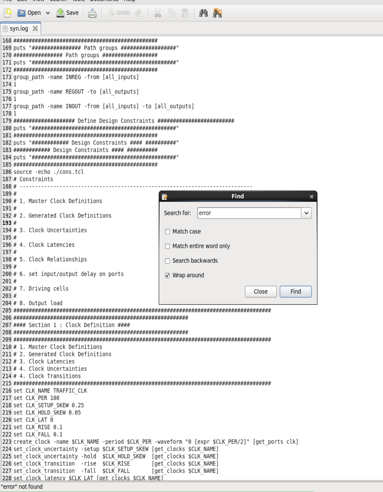
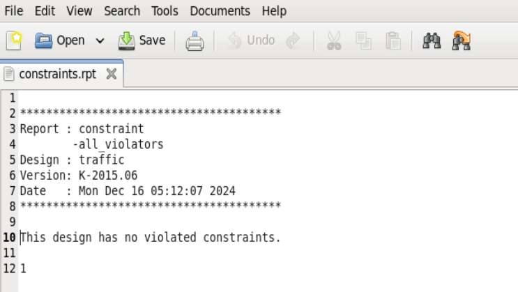
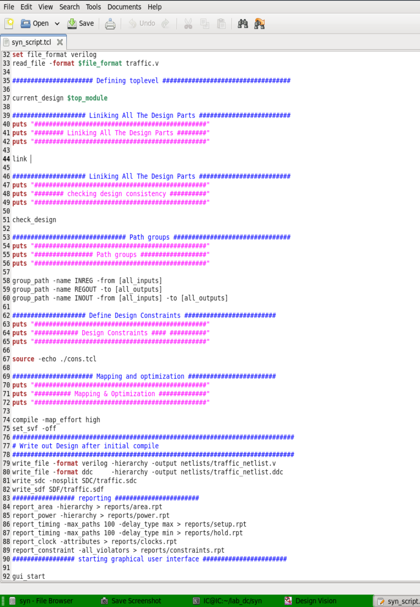
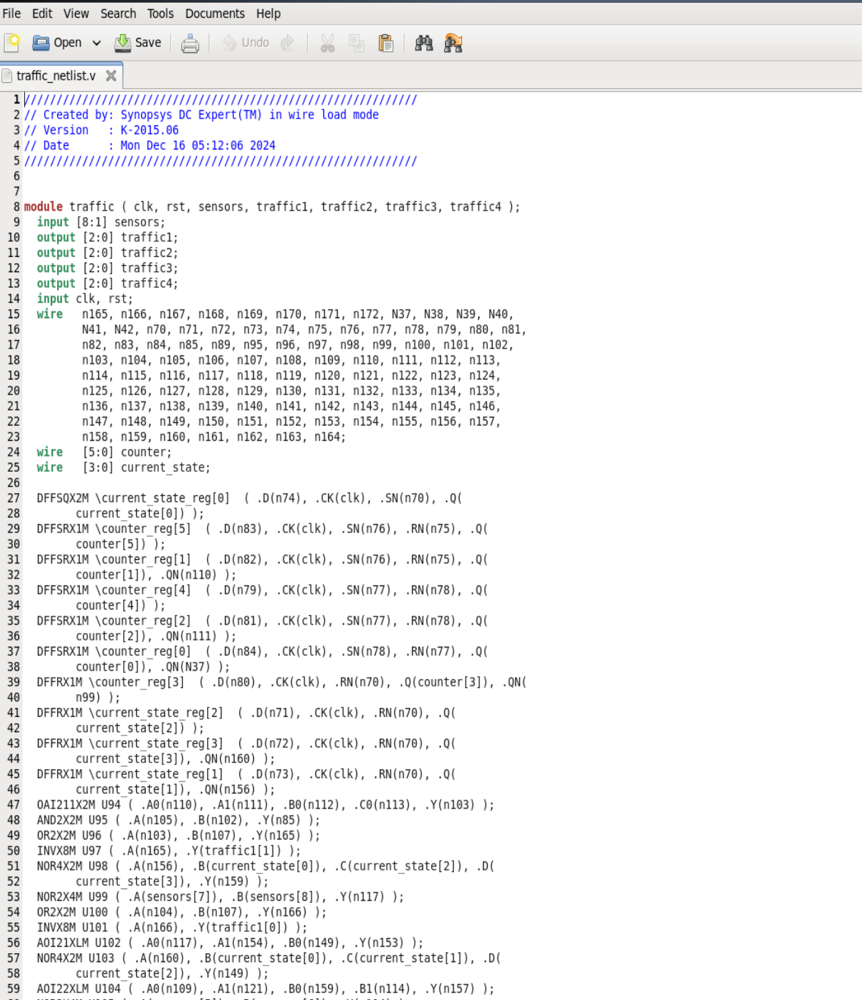
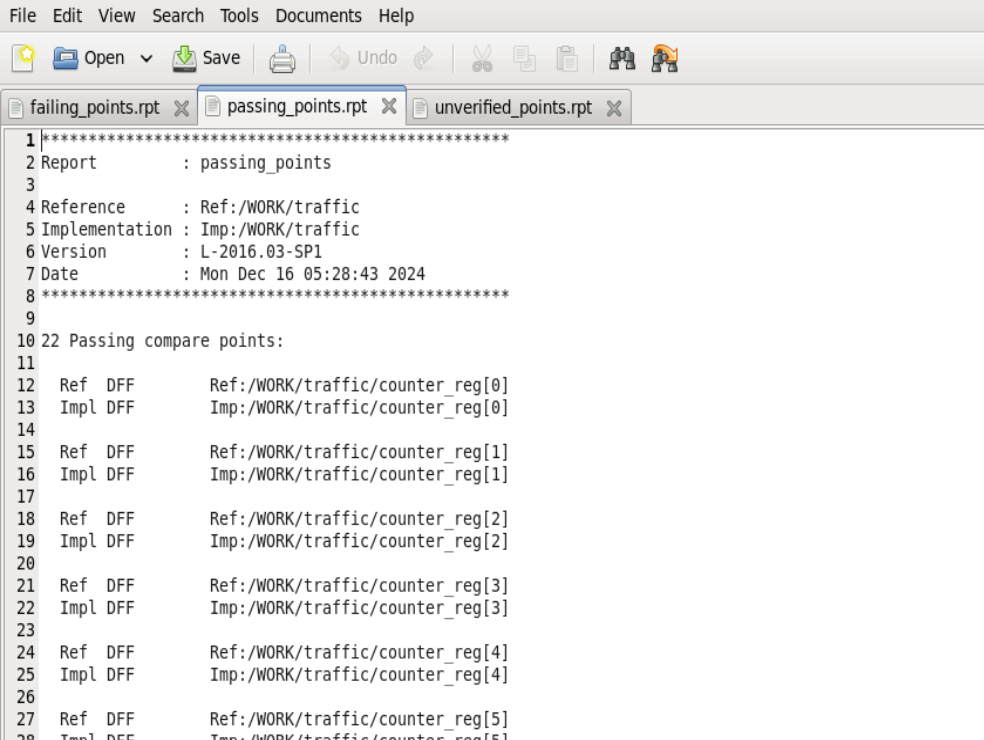
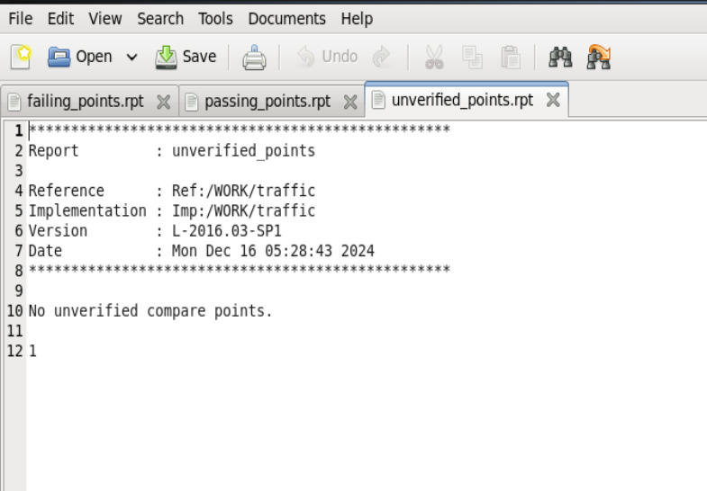
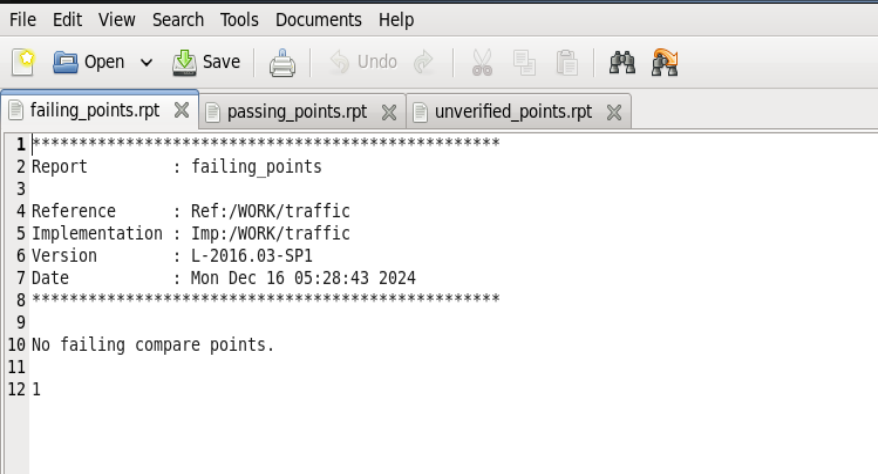
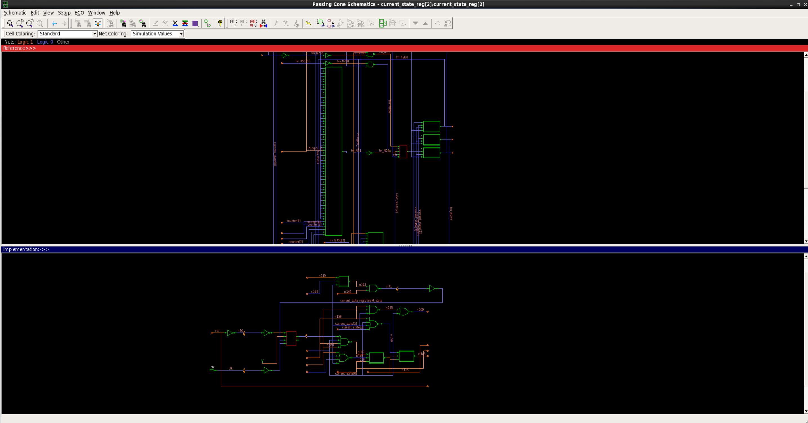

# Steps Followed

1. Edited the `syn_script` file to synthesize the Verilog design.  
2. Used the `const.tcl` file to apply constraints (clock timing, input delay, output load) on the design.  
3. Ran the synthesis tool to produce an output netlist that includes gates from the standard library along with their respective delays.  
4. Reviewed the power, area, and Static Timing Analysis (STA) reports generated by the synthesis tool.  
5. Confirmed that there are no setup or hold violations and that the slack time is sufficient.  
6. Verified that power consumption and chip area meet the design requirements.  
7. Used the Synopsys Formality Equivalence Checking tool to compare the output netlist with the input RTL code.  

# Schematic

---

# Synthesis Log

---

# Constraints Report

---

# Synthesis Script

---

# Output Netlist

---

# Formal Verification Reports

  
  
  

---

# RTL vs Netlist

